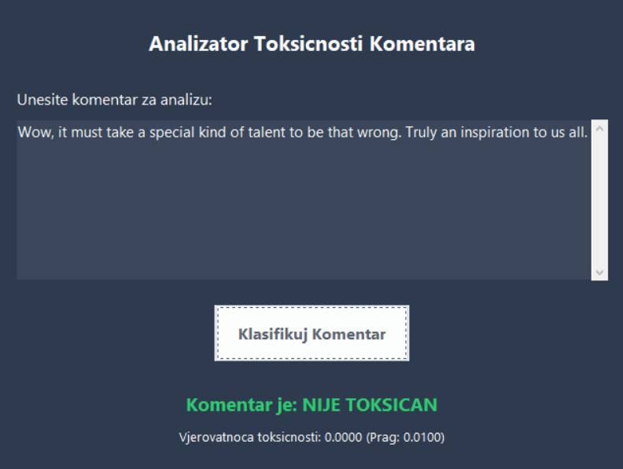
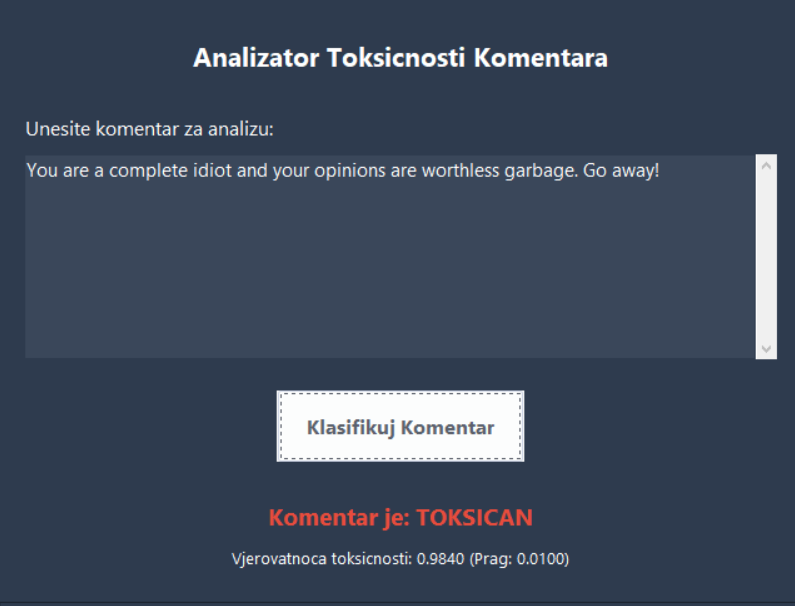
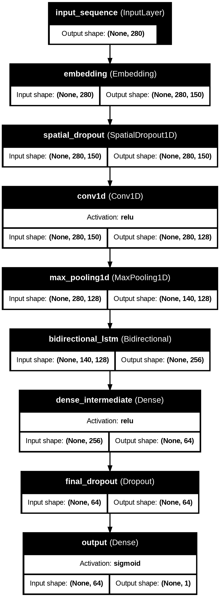

# AI-Powered Toxic Comment Classifier

> A project for the Artificial Intelligence course at the **Faculty of Electrical Engineering, University of Sarajevo**.
> 
> **Department:** Computer Science and Informatics
> 
> **Academic Year:** 2024/2025

<br>

A deep learning system designed to automatically classify text comments as **"Toxic"** or **"Non-Toxic."** This project features a hybrid CNN + Bi-LSTM model built from scratch in Keras/TensorFlow and includes a desktop GUI application for real-time analysis.

<br>



*^Application correctly identifying a non-toxic comment.*

<br>



*^Application correctly identifying a toxic comment.*

---

## 📋 Table of Contents
- [Project Goal](#-project-goal)
- [Key Concepts](#-key-concepts)
- [Dataset & Preprocessing](#-dataset--preprocessing)
- [Model Architecture](#-model-architecture)
- [Performance & Results](#-performance--results)
- [How It Works](#-how-it-works)
- [Desktop Demo Application](#-desktop-demo-application)
- [Limitations & Future Work](#-limitations--future-work)
- [How to Run](#-how-to-run)
- [Team](#-team)

## 🎯 Project Goal

Social media platforms are inundated with user-generated comments, making manual moderation infeasible at scale. This project aims to solve this by developing an efficient AI model capable of real-time text classification, automatically identifying and filtering harmful content like hate speech, insults, and harassment to foster safer online environments.

## 💡 Key Concepts

*   **Artificial Intelligence (AI) & NLP:** The project leverages **Natural Language Processing**, a subfield of AI, to enable the machine to understand, interpret, and process human language.
*   **Toxic Comment:** Defined as any comment containing offensive, disrespectful, or otherwise harmful language.
*   **Text Classification:** The core task of assigning a predefined category (in this case, `Toxic` or `Non-Toxic`) to a given text input.

## 📊 Dataset & Preprocessing

The model was trained on a carefully prepared dataset to ensure robustness and fairness.

*   **Source:** [Jigsaw/Conversation AI - Toxic Comment Classification Challenge on Kaggle](https://www.kaggle.com/datasets/akashsuper2000/toxic-comment-classification)
*   **Size:** The dataset consists of **120k** training samples, **20k** validation samples, and **20k** test samples.
*   **Class Balance:** The dataset was balanced to a perfect **50/50 split** between `Toxic` and `Non-Toxic` classes.

#### Key Preprocessing Steps:
- **Initial Cleaning:** Removed missing values and exact duplicates across all data splits.
- **Data Leakage Prevention:** Verified and removed any comments that appeared in more than one set (e.g., train and validation, train and test).
- **Text Normalization:** A comprehensive cleaning pipeline was applied, which included:
    - HTML tag and URL removal.
    - Lowercasing and expansion of English contractions (e.g., "don't" -> "do not").
    - Removal of emojis and non-alphanumeric characters.
    - Elimination of comments that became empty or too short after cleaning.
- **Analysis:** Performed n-gram analysis, word frequency counts, and PCA visualizations to understand the data structure.

## 🏗️ Model Architecture

A hybrid deep learning model was designed to capture both local patterns and long-range contextual dependencies in the text.

<br>



<br>

*   **Embedding Layer:** Maps word indices to dense, trainable vectors of dimension `150`. The vocabulary size was set to **70,000**.
*   **Spatial Dropout:** Applied after the embedding layer for regularization to prevent overfitting on specific embedding features.
*   **1D Convolutional Layer (CNN):** A `Conv1D` layer with `128` filters and a `kernel_size` of `3` acts as an n-gram feature extractor.
*   **Max Pooling Layer:** A `MaxPooling1D` layer downsamples the feature maps, making the model more efficient and robust to the position of features.
*   **Bidirectional LSTM (Bi-LSTM):** A `Bidirectional` wrapper around an `LSTM` layer with `128` units captures contextual information from both forward and backward directions in the sequence.
*   **Classifier Head:** A final `Dense` classification head with `Dropout` for regularization and a `Sigmoid` activation function to output the final toxicity probability.

#### Training Configuration:
*   **Optimizer:** `AdamW` (Adam with Decoupled Weight Decay)
*   **Loss Function:** `BinaryCrossentropy`
*   **Callbacks:** `EarlyStopping` (monitoring `val_auc`), `ModelCheckpoint` (saving the best model).
*   **Key Tools:** TensorFlow, Keras, Scikit-learn, Pandas, Matplotlib.

## 📈 Performance & Results

After training and tuning the classification threshold on the validation set, the model achieved the following performance on the **held-out test set**:

| Metric          | Score   |
|-----------------|---------|
| **AUC (ROC)**   | **0.9752**  |
| **F1 Score**    | **0.9230**  |
| **Accuracy**    | **0.9238**  |
| **Precision**   | **0.9238**  |
| **Recall**      | **0.9223**  |

### Comparison with Other Methods

The model demonstrates strong performance, outperforming baseline methods and approaching the results of larger, more complex Transformer-based models, despite being trained from scratch.

| Method                          | AUC      | F1 Score | Notes                                    |
|---------------------------------|----------|----------|------------------------------------------|
| Logistic Regression (Baseline)  | ~0.85    | ~0.78    | Basic model on TF-IDF features.            |
| Standard CNN + GloVe            | ~0.97    | ~0.90    | Uses pre-trained embeddings, lacks context.  |
| **Our CNN + Bi-LSTM (from scratch)** | **0.975**  | **0.923**  | **Strong balance of performance and efficiency.** |
| Detoxify (RoBERTa-Large)        | ~0.989   | ~0.94+   | State-of-the-art Transformer model.        |

## ⚙️ How It Works

The algorithm flow is as follows:

1.  **Input:** A raw text comment is provided by the user.
2.  **Preprocessing:** The text goes through the `full_clean` pipeline (lowercase, HTML/URL removal, contraction expansion, etc.).
3.  **Tokenization & Padding:** The cleaned text is converted into a sequence of numerical tokens and padded to a fixed length (`MAX_LEN=280`).
4.  **Prediction:** The padded sequence is fed into the trained model:
    *   The **Embedding Layer** converts tokens to vectors.
    *   The **CNN** and **MaxPooling** layers extract key local features.
    *   The **Bi-LSTM** layer analyzes the sequence of features for context.
    *   The **Dense Head** produces a final probability score.
5.  **Classification:** The output probability is compared against the **optimal threshold (e.g., 0.2405)** to classify the comment as `Toxic` or `Non-Toxic`.

## 🖥️ Desktop Demo Application

A desktop application was developed using **Python's Tkinter** and the **`ttkthemes`** library to provide a user-friendly interface for real-time classification. The application loads the trained Keras model and tokenizer, allowing users to input any text and receive an instant toxicity analysis.

## 🚧 Limitations & Future Work

*   **Generalization:** The model is highly tuned to the Kaggle dataset's domain (Wikipedia comments) and may perform differently on slang-heavy platforms like Twitter or TikTok.
*   **Sarcasm & Irony:** Detecting implicit toxicity, such as sarcasm, remains a significant challenge for this architecture.
*   **Future Work:**
    *   Experiment with Transformer-based architectures (like BERT or DistilBERT) and fine-tuning.
    *   Implement data augmentation techniques to improve robustness.
    *   Explore model calibration to make output probabilities more reliable.

## 🚀 How to Run

1.  **Clone the Repository:**
    ```bash
    git clone https://github.com/YourUsername/YourRepositoryName.git
    cd YourRepositoryName
    ```

2.  **Set up a Virtual Environment:**
    ```bash
    python -m venv .venv
    source .venv/Scripts/activate  # On Windows Git Bash / Linux / macOS
    # .\.venv\Scripts\activate      # On Windows CMD/PowerShell
    ```
3.  **Install Dependencies:**
    A `requirements.txt` file is provided for easy installation.
    ```bash
    pip install -r requirements.txt
    ```

4.  **Run the Application:**
    ```bash
    python toxic_classifier_app.py
    ```

## 🧑‍💻 Team

This project was developed by:

*   **Zakir Šehić**
*   **Emir Duvnjak**
*   **Mahir Rešidović**
